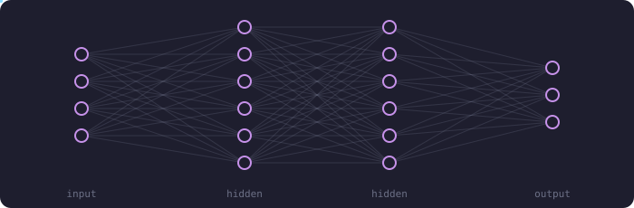

<p align="center">
  
</p>

<p align="center">
  
</p>

<p align="center">
  
</p>

```console
$ ls ~/projects
nextword-predict/   mask-detection/   eshop-intention/   hm-class-nn/   platziverse/
```

<p align="center">
  <a href="https://linktr.ee/yepedraza"></a>
  <a href="https://twitter.com/yepedraza"></a>
  <a href="https://www.linkedin.com/in/yery-pedraza-agudelo-84aba31b7/"></a>
</p>
